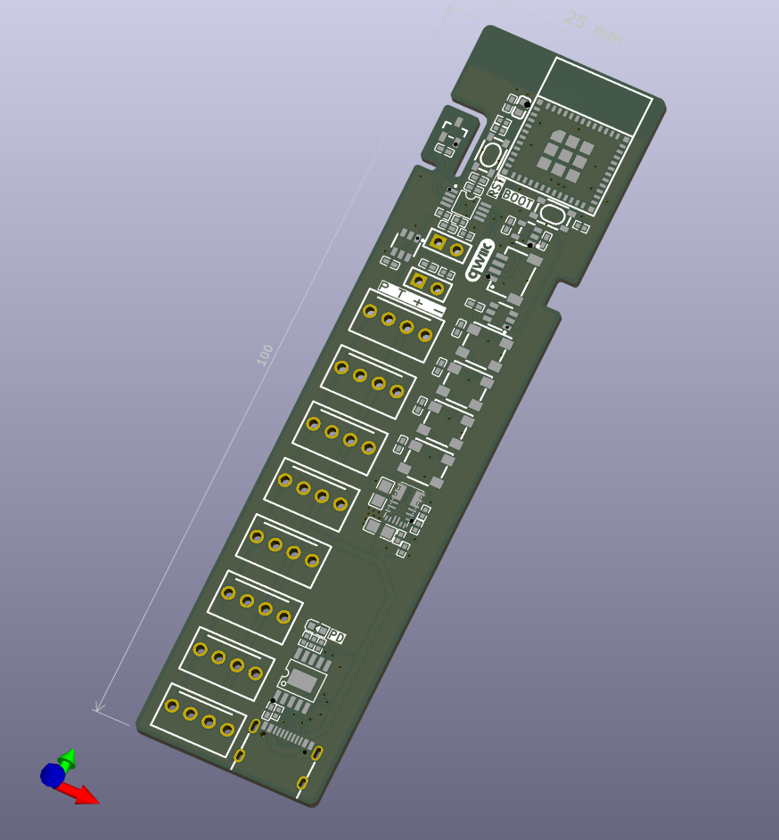

# fan_controller

## About
A simple controller for 4-pin PC fans with USB-PD as power input.
- 8x 4-pin PC fan connectors
- 2x 10kohm NTC temperature sensors connectors
- I2C via Qwiic connector
- USB-PD power input
    - 12V PD request voltage
    - PWR request ok LED
- EMC2101 fan controller
    - tachometer input (first fan connector)
    - PWM output (3.3V buffered fan PWM signal)
    - external temperature sensor
- 4x RGBW addressable LEDs
- ESP32C3 microcontroller

Created with [Atopile](https://atopile.com)
